# DDM Submit & Release 完整流程

## 1. 状态机总览

一次数据交付经历三个阶段，由 `submit` 和 `release` 两个命令驱动：

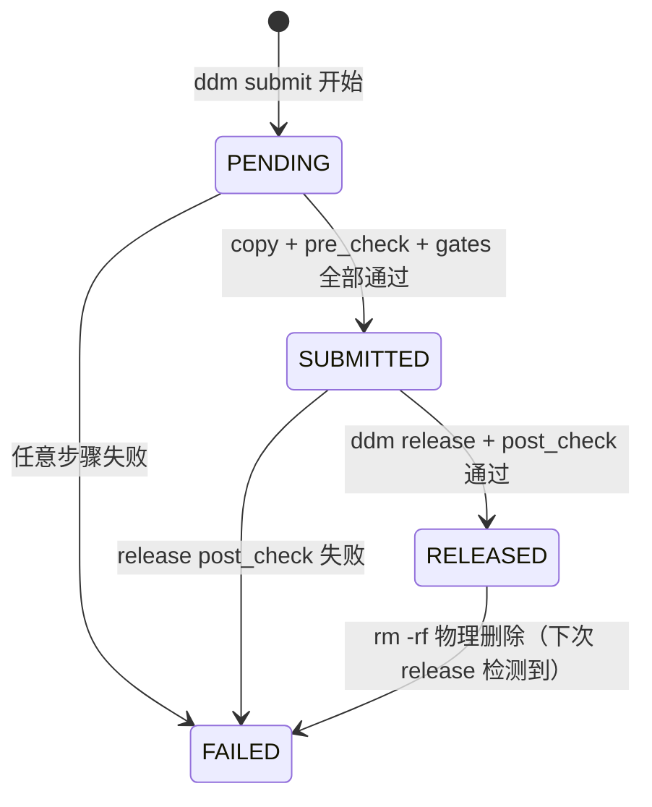

```
PENDING ──(copy+pre_check+gate+atomic move)──▶ SUBMITTED ──(staging+post_check+commit)──▶ RELEASED
    │                                                   │                                      │
    └── (any failure) ──────────────────────▶ FAILED ◀──┘                                      │
                                                                                               │
    RELEASED ──(物理文件被删除)──▶ release_file_missing 事件（下次 release 审计发现）
```

---

## 2. 数据流转路径

```
a0.outgoing/{user}/{module}/         ← 工程师私有源目录
        │
        │ ddm submit
        │ streaming_copy (边拷贝边 BLAKE3)
        ▼
raw/{TAG}/{MODULE}/                  ← 临时暂存区
        │
        │ pre_check: size + BLAKE3 vs a0 源文件
        │ run_gates: subprocess 黑盒门禁
        │ os.replace() 原子移动
        ▼
ready/{TAG}/{MODULE}/                ← 就绪暂存区（临界区）
        │
        │ ddm release
        │ Pass 1: copy2 → staging
        │ Pass 1b: inherit from latest
        │ Pass 2: size diff vs 上一版本
        │ Pass 3: post_check (size + mtime + BLAKE3)
        │ os.rename() / merge_dirs()
        ▼
release/{TAG}/latest → VERSION/     ← 最终发布归档
```

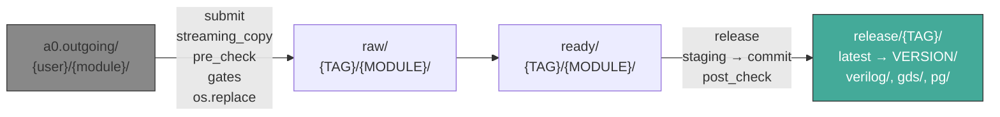

---

## 3. Submit 流程

### 3.1 命令参数

```
ddm submit -m <MODULE> -t <TAG> [-s <SUMMARY>] [-c <CONFIG>]
```

| 参数 | 必需 | 说明 |
|------|------|------|
| `-m / --module` | 是 | 模块名（CPU, DDR, ...） |
| `-t / --tag` | 是 | 标签（PV_ITER, LVS_PASS, ...） |
| `-s / --summary` | 否 | 提交备注 |
| `-c / --config` | 否 | 指定配置文件路径 |

### 3.2 Submit 流水线

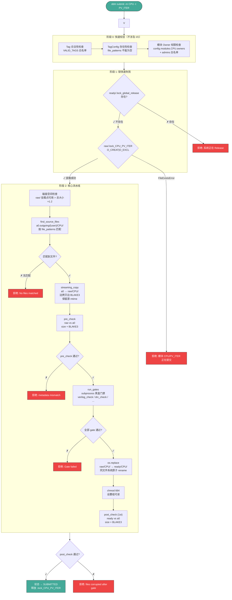

### 3.3 快速失败 (Fast-Fail) 顺序

Submit 把最轻量的检查放在最前面，避免做无用功：

```
1. Tag 白名单检查        ← 纯内存，零 I/O
2. TagConfig 存在性        ← 纯内存
3. 模块 Owner 权限         ← 读 config 内存中的列表 + admins 白名单
4. 全局锁检查              ← 1 次 stat()
5. 模块锁获取              ← 1 次 O_CREAT|O_EXCL (原子)
6. 磁盘空间检查            ← 1 次 statvfs()
   --- 以上失败都不写入 SQLite ---
7. find_source_files      ← 第 1 次目录扫描
8. create_batch (SQLite)  ← 此时才开始写数据库
```

### 3.4 文件发现 (find_source_files)

```python
# outgoing_root 模板展开
"./a0.outgoing/{user}/{module}"  →  "./a0.outgoing/wangshuai/CPU"

# file_patterns 模板展开（只用 {module} 命名文件）
"{module}.v.gz"  →  "CPU.v.gz"
"{module}.hier.gds"  →  "CPU.hier.gds"

# 在展开后的目录下 fnmatch 匹配
a0.outgoing/wangshuai/CPU/
    CPU.v.gz          ✓ 匹配 "CPU.v.gz"
    CPU.hier.gds      ✓ 匹配 "CPU.hier.gds"
    CPU.v.pg          ✓ 匹配 "CPU.v.pg"
    DDR.v.gz          ✗ 不匹配
```

### 3.5 门禁系统 (Gates)

门禁是配置驱动的黑盒 subprocess 调用，DDM 不关心内部逻辑：

```yaml
defaults:
  tag:
    PV_ITER:
      gates:
        - name: verilog_syntax_check
          command: python3 -m ddm.gates.verilog_check
        - name: drc_check
          command: python3 -m ddm.gates.drc_check
```

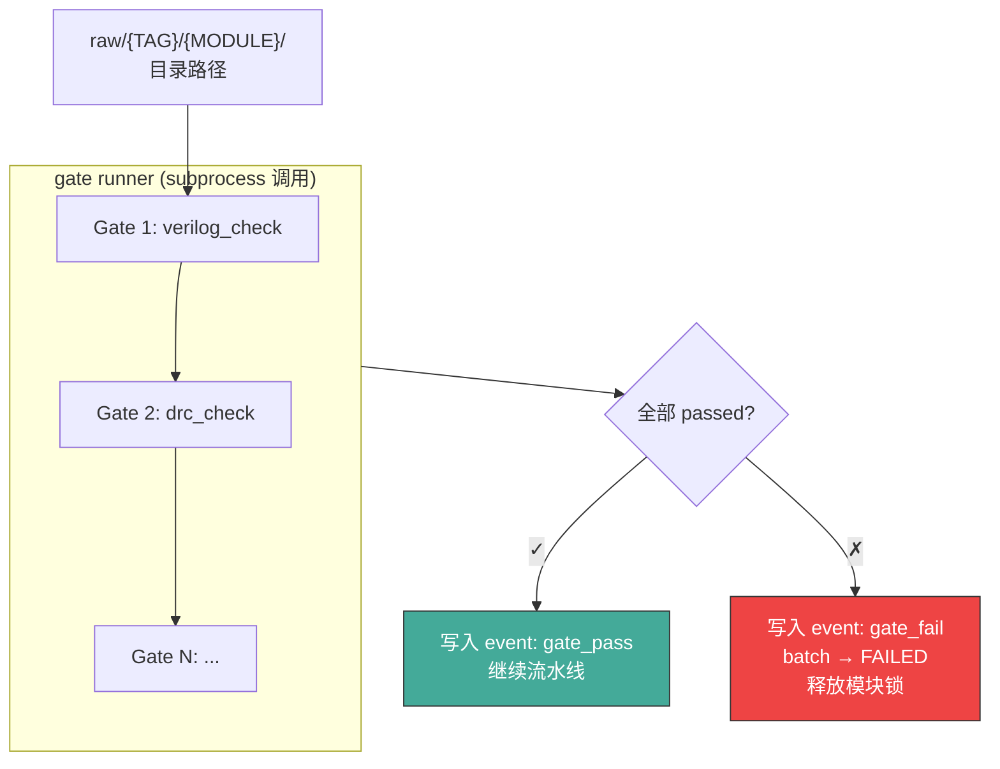

**约定：**
- `exit 0` → 通过，stdout 作为详情
- `exit ≠ 0` → 失败，stderr 作为失败原因写入 event
- 串行执行，任何一个失败即停止
- 无 gate 配置的 tag 跳过此阶段

### 3.6 ready/ 目录结构

```
ready/
├── .lock_global_release          ← 全局发布锁
├── PV_ITER/
│   ├── CPU/
│   │   ├── CPU.v.gz
│   │   ├── CPU.hier.gds
│   │   └── CPU.v.pg
│   └── DDR/
│       └── ...
├── LVS_PASS/
│   └── ...
└── BASE_CLEAN/
    └── ...
```

每个文件能回溯到它的 batch：

```
SQLite files 表:
  source_path  → a0.outgoing/wangshuai/CPU/CPU.v.gz
  raw_path     → raw/PV_ITER/CPU/CPU.v.gz       (submit 中途)
  ready_path   → ready/PV_ITER/CPU/CPU.v.gz      (submit 完成后)
  release_path → release/PV_ITER/V1_20260717/verilog/CPU.v.gz  (release 后)
```

---

## 4. Release 流程

### 4.1 命令参数

```
ddm release -t <TAG> (-m <MODULE> | -A) [-v <VERSION>] [--inherit]
```

| 参数 | 必需 | 说明 |
|------|------|------|
| `-t / --tag` | 是 | 发布标签 |
| `-m / --module` | 与 -A 二选一 | 发布单个模块，其余模块自动从 latest 继承 |
| `-A / --all` | 与 -m 二选一 | 发布该 tag 配置的**全部**模块，缺一不可 |
| `-v / --version` | 否 | 版本标签，默认取当天日期（YYYYMMDD） |
| `--inherit` | 否 | 配合 -A 使用，允许从 latest 继承未提交模块 |

### 4.2 版本命名规则

```
-v V1        →  V1_20260717   （label + 日期后缀）
-v ""        →  20260717       （不传则纯日期）
```

每次 release 在 `release/<TAG>/` 下创建一个版本目录，`latest` 软链接指向最新版本。

---

### 4.3 Release 流水线

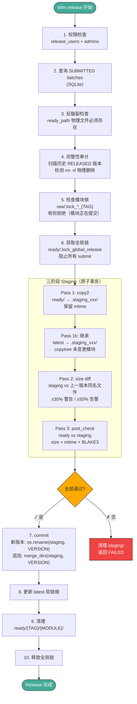

---

### 4.4 三种发布模式

#### 4.4.1 单模块发布：`-m <MODULE>`

只发布指定模块的一个 SUBMITTED batch，**其他模块自动从 `latest` 继承**。

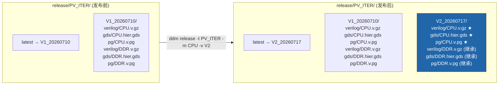

**逻辑：**
1. 查询 `batches WHERE tag=PV_ITER AND module=CPU AND status=SUBMITTED`
2. 只拷贝 CPU 的 ready 文件到 staging
3. 扫描 `latest`（V1_20260710）中除 CPU 之外的模块 → DDR 完整继承
4. post_check → commit → 更新 latest → 清理 ready/CPU/

#### 4.4.2 全量发布：`-A`

发布该 tag 配置中 `modules` 列表里的**所有模块**，每个模块都必须有 SUBMITTED 数据。

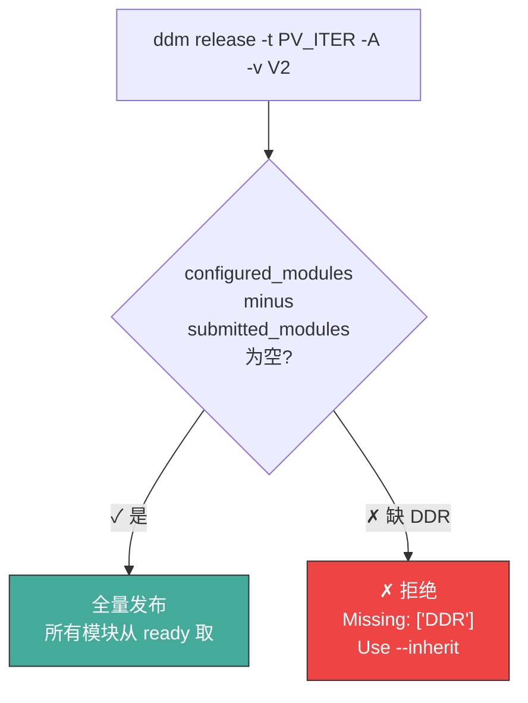

```
release/PV_ITER/
├── latest → V2_20260717
├── V1_20260710/
│   ├── verilog/CPU.v.gz, DDR.v.gz
│   ├── gds/CPU.hier.gds, DDR.hier.gds
│   └── pg/CPU.v.pg, DDR.v.pg
└── V2_20260717/
    ├── verilog/CPU.v.gz, DDR.v.gz  ← ★ 新发布
    ├── gds/CPU.hier.gds, DDR.hier.gds
    └── pg/CPU.v.pg, DDR.v.pg
```

#### 4.4.3 全量发布 + 继承：`-A --inherit`

全量发布，允许某些模块没有新数据 —— 自动从 `latest` 继承。

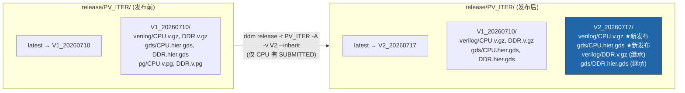

---

### 4.5 版本继承机制

#### 继承触发条件

| 模式 | 何时继承 |
|------|----------|
| `-m MODULE` | 始终继承（除了指定模块外的所有模块） |
| `-A` | 不继承，缺少任何模块直接报错 |
| `-A --inherit` | 只继承配置中有但本次未 SUBMITTED 的模块 |

#### 继承逻辑

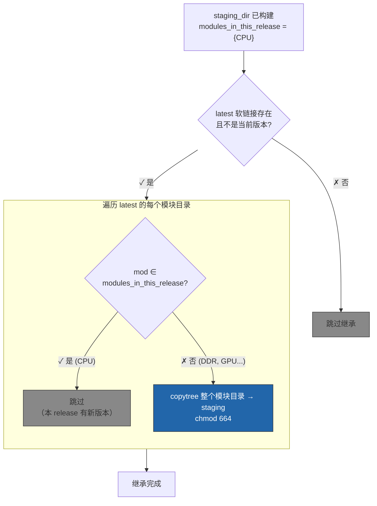

**关键规则：按文件类型分组**
- 文件通过 `file_groups` 配置映射到 verilog/gds/pg 等子目录，各模块文件在 group 内混合存放
- 文件名自带模块前缀（`CPU.v.gz`），无需模块层级目录区分
- 未匹配 file_groups 的文件直接放在版本根目录

---

### 4.6 三阶段 Staging 提交

为保障原子性，release 先将所有文件写入临时 staging 目录，全部校验通过后再一次性提交：

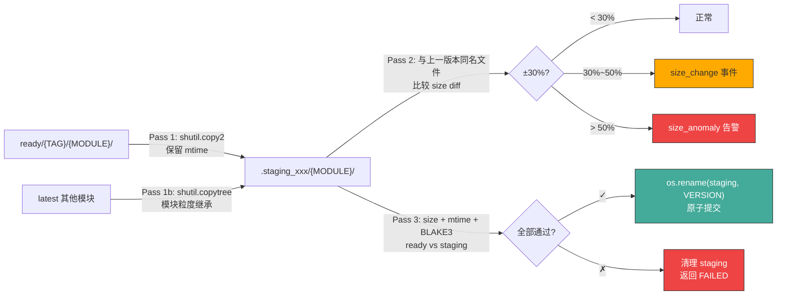

#### post_check 三要素

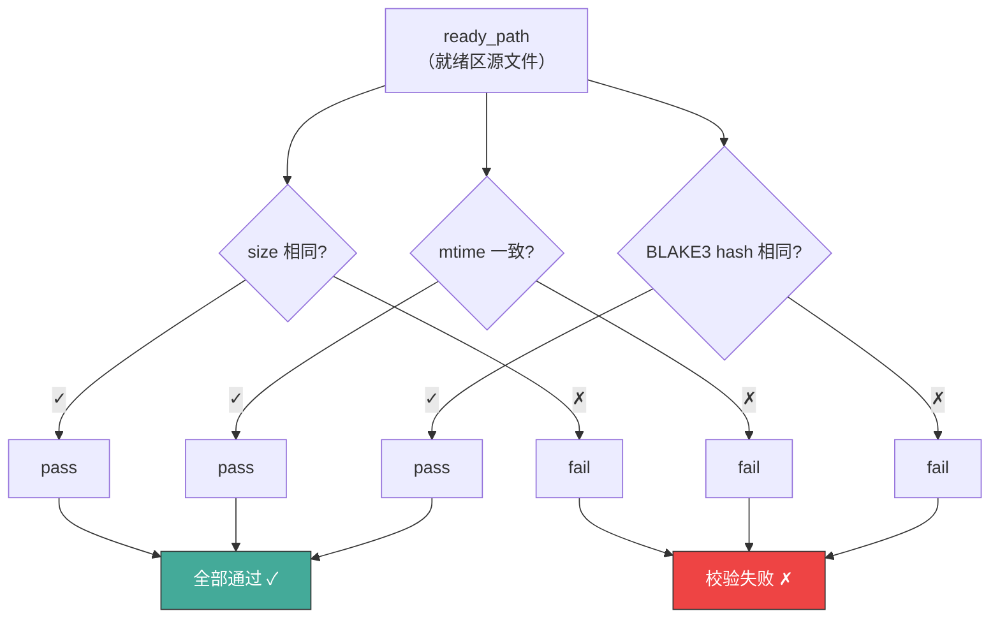

---

### 4.7 发布到已有版本（追加/覆盖）

**`-m MODULE`**：始终允许追加到已有版本（增量更新，添加一个模块的数据）。

**`-A`**：全量发布到已有版本是破坏性操作（覆盖所有模块），默认**拒绝**。

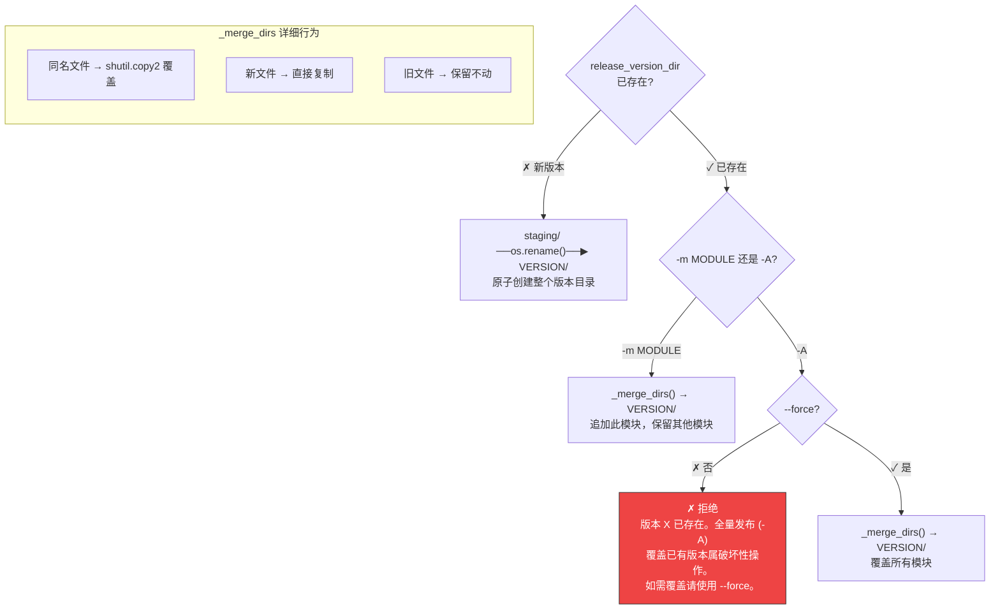
    end

    style NEW_VER fill:#26a,stroke:#333,color:#fff
    style MERGE fill:#a4a,stroke:#333,color:#fff
```

---

### 4.8 完整性审计

每次 release 都会扫描**历史所有 RELEASED 状态**的 batch，检测物理文件是否被 `rm -rf` 删除：

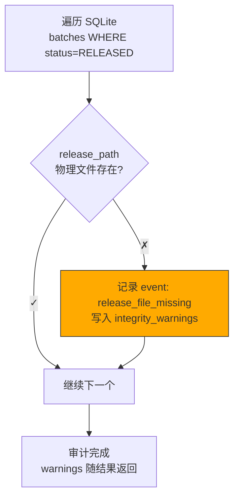

---

## 5. 锁机制

锁机制同时服务于 submit 和 release，是整个系统的并发控制基础。

### 5.1 原子锁实现

锁的核心实现在 `ddm/services.py`：

```python
def _acquire_lock(lock_path: Path, description: str) -> None:
    lock_path.parent.mkdir(parents=True, exist_ok=True)
    try:
        fd = os.open(str(lock_path), os.O_CREAT | os.O_EXCL | os.O_WRONLY)
        with os.fdopen(fd, "w") as f:
            f.write(f"pid={os.getpid()}\ntime={time.time()}\n")
    except FileExistsError:
        raise LockError(f"... lock exists: {lock_path}")
```

**`O_CREAT | O_EXCL` 是 POSIX 内核级原子操作**——不是"先检查再创建"（那才有 TOCTOU 竞态），而是创建和存在性检查作为一个不可分割的系统调用完成。内核保证：无论多少进程同时调用，**恰好一个进程创建成功**。

### 5.2 并发 Submit 同一模块不会冲突

两个用户同时 `ddm submit -m CPU -t PV_ITER`：

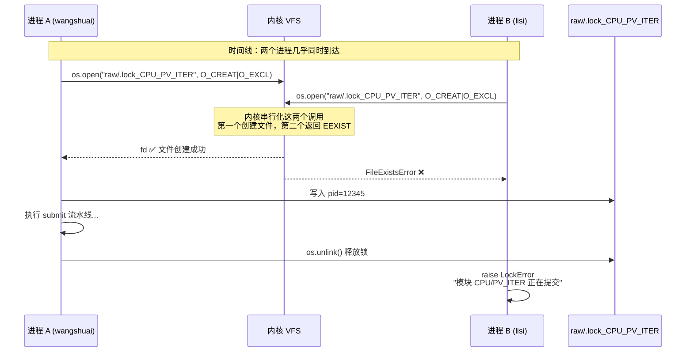

无论两个进程间隔多近（同一纳秒），内核 VFS 层的 inode 创建是串行化的，**不存在"两个进程同时创建同一个锁文件"的情况**。

### 5.3 不同模块之间不互斥

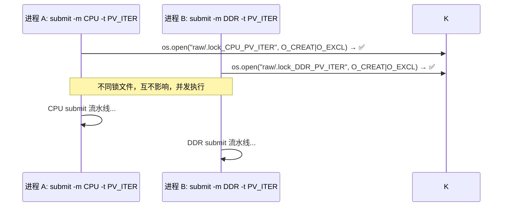

### 5.4 两层锁交互

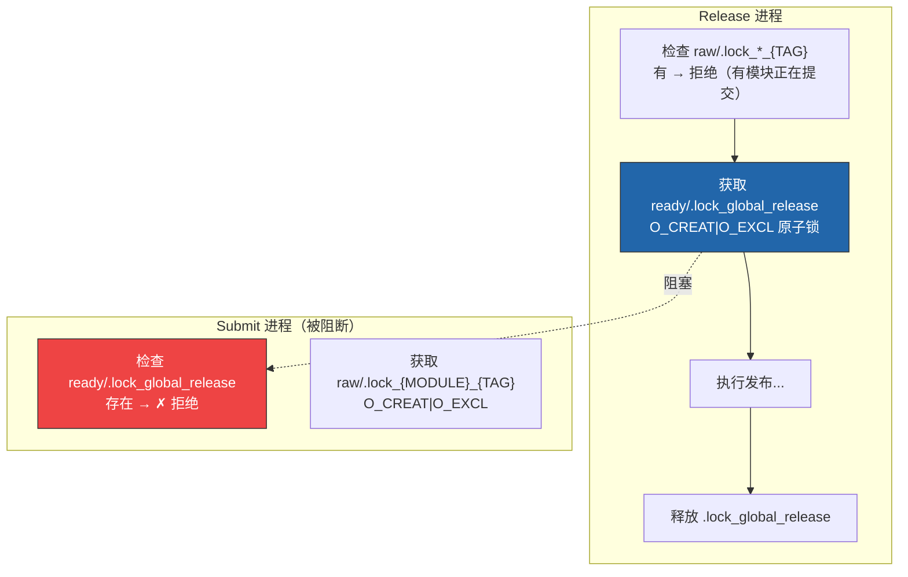

### 5.5 锁互斥矩阵

| | Submit CPU/PV | Submit DDR/PV | Release PV |
|---|---|---|---|
| 无锁 | ✓ | ✓ | ✓ |
| `.lock_global_release` 被持有 | ✗ | ✗ | ✗ |
| `.lock_CPU_PV_ITER` 被持有 | ✗ | ✓ | ✗ |
| `.lock_DDR_PV_ITER` 被持有 | ✓ | ✗ | ✗ |

### 5.6 锁文件位置

```
repository/
├── raw/
│   ├── .lock_CPU_PV_ITER          ← 模块级锁（submit 持有）
│   ├── .lock_DDR_PV_ITER
│   └── .lock_CPU_BASE_CLEAN
└── ready/
    └── .lock_global_release       ← 全局锁（release 持有）
```

**关键设计决策：**
- 锁文件与数据在同一文件系统 → `O_CREAT|O_EXCL` 语义正确（NFSv3 有风险，建议 NFSv4 或本地盘）
- 锁文件不是 0 字节 → 内含 pid + 时间戳，方便人工排查残留锁
- `finally` 块保证异常路径也释放锁 → 不会死锁

---

## 6. 用户决策树

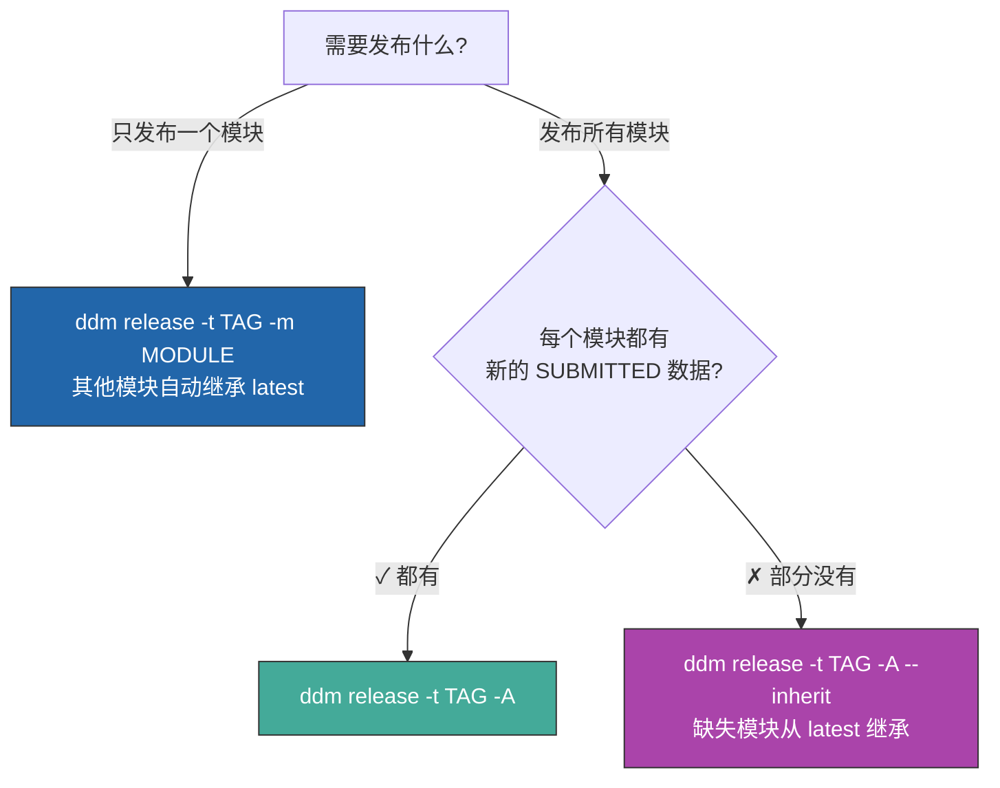

---

## 7. 完整生命周期示例

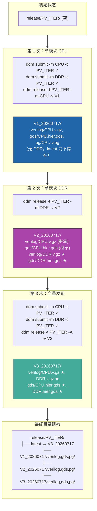
